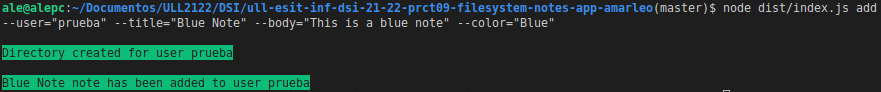
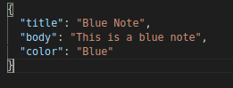
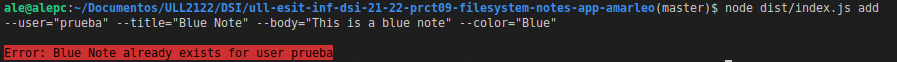
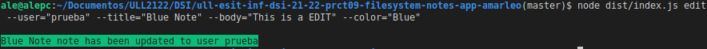
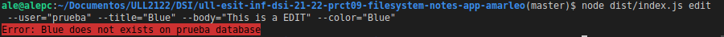
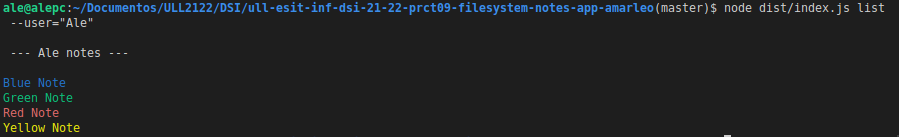

# Práctica 9: Aplicación de procesamiento de notas de texto

[](https://github.com/ULL-ESIT-INF-DSI-2122/ull-esit-inf-dsi-21-22-prct09-filesystem-notes-app-amarleo/actions/workflows/coveralls.yml)

[](https://github.com/ULL-ESIT-INF-DSI-2122/ull-esit-inf-dsi-21-22-prct09-filesystem-notes-app-amarleo/actions/workflows/sonarcloud.yml)

[](https://github.com/ULL-ESIT-INF-DSI-2122/ull-esit-inf-dsi-21-22-prct09-filesystem-notes-app-amarleo/actions/workflows/nodejs.yml)

## Indice

- [Práctica 9: Aplicación de procesamiento de notas de texto](#práctica-9-aplicación-de-procesamiento-de-notas-de-texto)
  - [Indice](#indice)
  - [Introducción](#introducción)
  - [Tareas Previas](#tareas-previas)
  - [Desarrollo de la Práctica](#desarrollo-de-la-práctica)
    - [Testing](#testing)
    - [Código desarrollado](#código-desarrollado)
  - [Conclusión](#conclusión)

## Introducción

El presente informe perteneciente a la novena práctica de la asignatura de Desarrollo de Sistemas Informáticos, la cuál tiene como principales objetivos el manejo de ficheros JSON haciendo uso de la API síncrona de Node.js, además de hacer uso de [Yargs](https://www.npmjs.com/package/yargs) para la interacción de la aplicación a través de la línea de comandos. Por último, con el objetivo de ilustrar de forma más llamativa los resultados de las operaciones llevadas a cabo por el usuario, se hará uso del paquete [Chalk](https://www.npmjs.com/package/chalk).

## Tareas Previas

Tal y como se comentó en la introducción, se han propuesto dos nuevos paquetes de NPM para poner en práctica durante el desarrollo de esta práctica. Antes de comenzar a desarrollar el código, se ha realizado la instalación de los mismos.

Por otro lado, se han leido y comprobado la documentación propuesta sobre la API síncrona proporcionada por Node.js para trabajar con el sistema de ficheros. El link a este recurso se encuentra a continuación: [Link](https://nodejs.org/dist/latest-v18.x/docs/api/fs.html#synchronous-api)

## Desarrollo de la Práctica

Antes de comenzar a comentar y ejemplificar el resultado de la práctica, se va a proceder a enumerar las ideas principales que se han tenido en cuenta para el desarrollo de la misma.

En primer lugar, teniendo en cuenta lo propuesto para esta práctica, se ideado posibles clases a desarollar. Como es evidente, principalmente se ha creado una clase para las **Notas**. Con ello se consigue determinar las diferentes características exigidas para una nota en el enunciado. En este caso se pide que una nota tenga como mínimo un título, un contenido y un color. Sabiendo esto, se puede intuir que serán los 3 principales atributos de la clase.

Por otro lado se exige que el sistema de ficheros sea para múltiples usuarios, donde cada usuario puede tener un listado de notas. Sabiendo esto, se extrae que, los atributos principales para la clase **Usuario** sean su nombre y un array de objeto Notas.

Los diferentes métodos que se exigen respecto a la obtención, edición, creación y borrado de notas se pondrán en disposición de esta última clase.

### Testing

Tal y como ha sido de costumbre hasta ahora, en primer lugar se han creado con Mocha y Chai diferentes tests para las clases a desarrollar. No sólo se comprueban que los diferentes setters y getters gestionan los datos de los atributos de forma correcta, sino que también, los métodos tienen un comportamiento adecuado. Para el caso de Notas no se han desarrollado métodos y por tanto los tests obtenidos son únicamente para la gestión de sus atributos.

Por otra parte, para el caso de User si ha sido necesario crear diferentes escenarios y expectativas. Obviando la comprobación de getters y setters, se muestra a continuación algunos de los métodos y cómo han sido testeados: 

```typescript
  describe('User Class methods', () => {
    describe('add Note method', () => {
      user.notes = [blueNote];
      user.addNote(redNote);
      it('If it does not exists, it must create a new directory', () => {
        expect(fs.existsSync('./database')).to.be.true;
      });
      it('If it does not exists, it must create a new user directory', () => {
        expect(fs.existsSync('./database/user')).to.be.true;
      });
      it('There should be 2 files', () => {
        expect(fs.existsSync('./database/user/Blue Note.json')).to.be.true;
        expect(fs.existsSync('./database/user/Red Note.json')).to.be.true;
      });
    });
```

Este ejemplo gestiona el método de añadir una nueva nota a un usuario. Tal y como se puede ver, en un primer momento se efectúa la creación de una nota sobre el user. A continuación, se comprueba que, además de existir los directorios correspondientes a la **database** y al usuario en cuestión, comprueba si existen los dos ficheros que se han setteado al usuario.

```typescript
    describe('edit Note method', () => {
      it('Initial content of red note', () => {
        expect(fs.readFileSync(
            './database/user/Red Note.json', {encoding: 'utf8', flag: 'r'}))
            .to.be.eql(
                '{\n\t"title": "Red Note",' +
                '\n\t"body": "This is a red note",' +
                '\n\t"color": "Red"' +
                '\n}');
      });
      it('Final content of red note', () => {
        user.editNote(redNoteEdit);
        expect(fs.readFileSync(
            './database/user/Red Note.json', {encoding: 'utf8', flag: 'r'}))
            .to.be.eql(
                '{\n\t"title": "Red Note",' +
                '\n\t"body": "This is a EDIT",' +
                '\n\t"color": "Red"' +
                '\n}');
        user.editNote(redNote);
      });
    });
```

Otro ejemplo es el método **editNote**. Para testearlo, en un primer momento se ha comprobado el estado inicial del fichero Red Note, comprobando además de esta forma de que existe desde un primer momento dentro de la base de datos del usuario. Finalmente, se realiza una edición del fichero, comprobando que se ha editado correctamente.

### Código desarrollado

Una vez finalizado el desarrollo de los tests, se ha puesto en marcha a realizar los códigos correspondientes a las clases. En primer lugar, la clase **Note** no tiene mucho más de lo que se ha contado hasta ahora. Sin embargo, el único detalle a destacar de esta clase es que se ha creado un nuevo tipo denominado **noteColor**, junto con su guardián de tipo. Esto será necesario durante el desarrollo del index, para comprobar que el dato introducido por línea de comandos es correcto y se encuentra incluído entre las posibilidades.

Por otro lado, en adición a lo comentado para la clase **User** se encuentran los diferentes métodos para la gestión de notas de texto. A continuación se procede a hacer una serie de comentarios de los mismos: 

```typescript
  addNote(note: Note) {
    const databasePath: string = './database/' + this._name;
    const jsonPath: string = databasePath + '/' + note.title + '.json';
    if (!fs.existsSync('./database')) {
      fs.mkdirSync('./database');
      console.log(chalk.green.inverse('\nDatabase directory created'));
    }
    if (!fs.existsSync(databasePath)) {
      fs.mkdirSync(databasePath);
      console.log(chalk.green.inverse(
          `\nDirectory created for user ${this._name}`));
    }
    if (fs.existsSync(jsonPath)) {
      console.log(chalk.red.inverse(`\nError: ${note.title} already exists` +
        ` for user ${this._name}`));
    } else {
      const noteContent: string =
      `{\n\t"title": "${note.title}",` +
      `\n\t"body": "${note.body}",` +
      `\n\t"color": "${note.color}"` +
      `\n}`;
      fs.writeFileSync(jsonPath, noteContent);
      this._notes.push(note);
      console.log(chalk.green.inverse(`\n${note.title} note has been added` +
        ` to user ${this._name}`));
    }
  }
```

En primer lugar se encuentra el método **addNote**. Este reciube como parámetro un objeto de tipo Nota. Se realizan una serie de comprobaciones previas a la creación del fichero. En concreto son las siguientes:

- Si no existe el directorio **./database**, lo crea.
- Si no existe un directorio para el usuario en cuestión, lo crea.
- Si existe un fichero con el mismo nombre, no se añade.

En caso de no existir ningún fichero con dicho nombre, se crea un fichero JSON con su contenido.

```typescript
  editNote(note: Note) {
    const jsonPath: string = './database/' + this._name +
    '/' + note.title + '.json';
    if (fs.existsSync(jsonPath)) {
      const noteContent: string =
      `{\n\t"title": "${note.title}",` +
      `\n\t"body": "${note.body}",` +
      `\n\t"color": "${note.color}"` +
      `\n}`;
      fs.writeFileSync(jsonPath, noteContent);
      this._notes.push(note);
      console.log(chalk.green.inverse(`\n${note.title} note has been updated` +
        ` to user ${this._name}`));
    } else {
      console.log(chalk.red.inverse(`Error: ${note.title} ` +
        `does not exists on ${this._name} database`));
    }
  }
```

Para el método **edit** se ha creado un procedimiento similar a addNote, donde si existe un fichero con el nombre proporcionado, se edita el contenido del mismo.

```typescript
  removeNote(note: Note) {
    const jsonPath: string = './database/' + this._name +
     '/' + note.title + '.json';
    if (fs.existsSync(jsonPath)) {
      fs.unlink(jsonPath, (err) => {
        if (err) throw err;
        console.log(chalk.green.inverse(`\n${jsonPath} was deleted`));
      });
    } else {
      console.log(chalk.red.inverse(`Error: ${note.title} ` +
        `does not exists on ${this._name} database`));
    }
  }
```

Para el método **removeNote** se comprueba si existe el fichero y, en tal caso, se borra el mismo.

```typescript
  listAllNotes() {
    console.log(`\n --- ${this._name} notes ---\n`);
    const databasePath: string = './database/' + this._name;
    fs.readdirSync(databasePath).forEach((file: string) => {
      const note = new Note(file);
      const jsonPath: string = './database/' + this._name +
      '/' + note.title;
      let data: string = fs.readFileSync(jsonPath,
          {encoding: 'utf8', flag: 'r'});
      let dataObject = JSON.parse(data);
      if (dataObject.color === 'Blue') {
        console.log(chalk.blue(file.replace('.json', '')));
      }
      if (dataObject.color === 'Red') {
        console.log(chalk.red(file.replace('.json', '')));
      }
      if (dataObject.color === 'Yellow') {
        console.log(chalk.yellow(file.replace('.json', '')));
      }
      if (dataObject.color === 'Green') {
        console.log(chalk.green(file.replace('.json', '')));
      }
      if (dataObject.color === '') {
        console.log(file.replace('.json', ''));
      }
    });
  }
```

Debido a que se han de gestionar los colores de los ficheros durante su lsitado, se ha procedido a analizar el contenido de los mismos con **JSON.parse** obteniendo así el color actual que tienen establecidos los ficheros. De forma adicional, se ha colocado una condición donde si dicho campo se encuentra vacío, se muestra sin color.

Finalmente, se ha creado un programa **index** que gestionará el programa por línea de comandos. Para demostrar su uso, se van a mostrar una serie de capturas:

En primer lugar, se va a crear una nueva nota para el usuario **prueba**:



Como se puede observar, se muestra dos mensajes de confirmación, uno para la creación del directorio del usuario que no existía, ademas del fichero JSON.



En caso de volver a añadir el mismo nombre de fichero, se muestra el siguiente mensaje de error.



Si se intenta editar el fichero:



Y en caso de editar un fichero que no existe:



Como último ejemplo se muestra el listado de las notas:



## Conclusión

En esta práctica, se han puesto en práctica la gestión de comandos, así como el uso de ficheros por parte de la API Síncrona de NodeJS.

[Indice](#indice)
